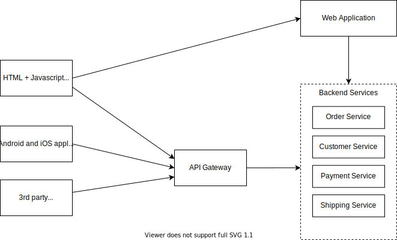
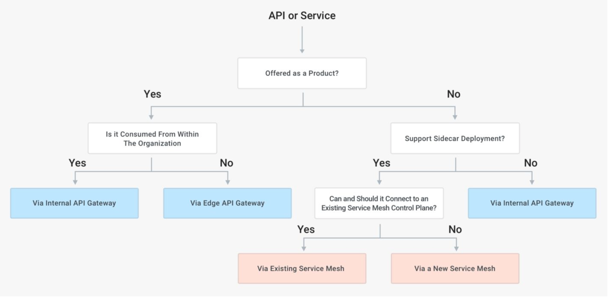

# API Gateways and/vs Service Mesh

Microservices have taken center stage in the software industry. Transitioning from a monolith to a microservices-based architecture empowers companies to deploy their application more frequently, reliably, independently, and with scale without any hassle.

However, when deploying multiple microservices some common problems we face are: 
1. how to communicate between the services and external world.
2. how to handle the inevitable communication failures smoothly and enforce network policies.

### How does an API Gateway work  

With each microservice, exposing their own endpoints via REST API, we could potentially face the following problems
* The client might need to interact with various services for details of a single product
* Various services might use a diverse set of protocols
* The backend services could change over time, and the client should to be agnostic to those changes.

**The solution is to implement an API gateway which is the single entry point for all clients.**  
The API gateway could, in turn, simply proxy the requests to the appropriate services, or fan-out the requests to various services, aggregate the response and return the appropriate result.

While this can **lead to increased complexity and response time due to additional network hop**, the advantages include
* Insulates the client from the various (evolving) microservices
* We can add Security, Authentication and Rate limiting to API Gateway itself
* Provides ability for Analytics, Monitoring or even Monetization of APIs
* Scale independently of the backend services

__API Gateway should be deployed in its own instance, separate from the client, and the backend APIs.__  
The APIs exposed by the API gateway are most likely running over HTTP Protocol (like REST, GraphQL, gRPC, SOAP etc), and the traffic can be both north-south (outside the datacenter) or east-west( inside the datacenter)

### Service Mesh

Consider an alternative scenario, where we want to build a service-to-service communication between two or more services.   
We would have to implement and re-implement traffic policies like security, observability and error handling in each of our services in possibly different programming languages.   
This can lead to fragmentation, and more management apart from the obvious security risks.  
What If we could outsource the network management of any request to a proxy living outside, (but alongside) our service.   
This proxy is by default portable and implements features like mutual TLS encryption, identity, routing, logging, tracing, load-balancing.   
This layer can document how well (or not) different parts of an app interact, so it becomes easier to optimize communication and avoid downtime as an app grows.

### How Does a Service Mesh Work?

A service mesh mainly consists of two essential components: **a data plane and a control plane**. Making fast, reliable, and secure service-to-service calls within a microservices' architecture is what a service mesh strives to do. 

Although it is called “mesh of services,” it is more appropriate to say “mesh of proxies” that services can plug into and completely abstract the network away.

In a typical service mesh, these proxies are infused inside each service deployment as a **sidecar**. Rather than calling services directly over the network, services call their local sidecar proxy, which handles the request on the service’s behalf, thus encapsulating the complexities of the service-to-service exchange. 
* The interconnected set of sidecar proxies implements what is known as the data plane. 
* The components of a service mesh that are employed to configure the proxies and gather metrics are collectively known as the service mesh control plane.

Service meshes are meant to resolve the multiple hurdles developers encounter while addressing to remote endpoints. In particular, service meshes help applications running on a container orchestration platform such as Kubernetes.

### Service Mesh Products
A service mesh is a great problem solver when it comes to managing your cloud applications. If anybody runs applications in a microservices architecture, they are probably considered a good candidate for a service mesh.  
As the organization adopts a microservices architecture, the services tend to grow in number, and a service mesh allows you to declutter the enhanced complexity from a huge collection of microservices.

Some widely-used service mesh products include:

* **[Istio](https://istio.io/)**, released in May 2017, is an open-source project from Google, IBM, and Lyft.
* **[Consul Connect](https://www.consul.io/)**, released in November 2018, is an open-source software project stewarded by HashiCorp.
* **[Linkerd](https://linkerd.io/)**, released in July 2018, is an open-source [Cloud Native Computing Foundation](https://cncf.io/?utm_content=inline-mention) incubating project primarily maintained and sponsored by Buoyant.

### API Gateway vs. Service Mesh: Better Together?

It is commonly mis-understood that API gateways are used for north-south traffic, while Service Meshes are for east-west traffic.   
A better definition would be that API gateways are generally more focussed on L7 traffic policies, while Service mesh support both L4/L7 traffic policies.

Another major difference between the two patterns is the deployment model.  
In a service mesh pattern, we must deploy a proxy data plane alongside each replica of each service.   
This can obviously be met with resistance.
Also, there might be legacy product boundaries or third party services, which don't allow access control from outside the service.

| API Gateway | Service Mesh |
|-------------|--------------|
| Handles <s>north-south</s> L7 traffic| Handles <s>east-west</s> L4/L7 traffic |
| Exposes services to make then easily consumable | Manages and controls services inside your network |
| Maps external traffic to internal resources| Focuses on brokering internal resources |
| Exposes APIs or edge services to serve a specific business function| Sits between network and service |

Companies can use an API gateway to offer APIs as a product to external or internal clients/users through a centralized ingress spot and to administer and regulate their exposure. This is generally used when complex applications need to talk to each other.

Image source: [Kong](https://konghq.com/blog/the-difference-between-api-gateways-and-service-mesh/) 